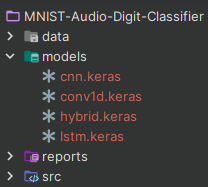

# MNIST-Audio-Digit-Classifier

This project utilizes deep learning techniques for the classification of the free-spoken-digit-dataset, offering an audio-oriented counterpart to the traditional MNIST dataset.

## Getting Started

To run this project, ensure that you have Python 3 installed on your system. Follow these steps:

1. Create a Python environment using the following commands:
    ```bash
    conda create -n audio python=3
    activate audio
    ```

2. Install the necessary libraries listed in the requirements.txt file:
    ```bash
    pip install -r requirements.txt
    ```

3. Clone this repository and navigate to the root folder.

4. Run the main.py file:
    ```bash
    python src/main.py
    ```

## Enhanced Workflow
When you execute the main.py file, it will perform the following workflow:
1. **Folder Preparation:**
   - Create the necessary folders for organizing data, models, and reports:
      - `data/processed`: Processed data will be stored here.
      - `data/production_data`: Random audio samples for production testing will be placed here.
      - `models`: Trained models will be saved in this folder.
      - `reports`: Graphical representations and evaluation metrics will be stored here.

        

2. **Data Arrangement:**
   - Arrange raw data into folders by digits and save them into the `data/processed_data` folder.

     

3. **Production Testing Data Selection:**
   - Select random audio samples from each digit to create a production testing dataset. These samples will be stored in the `data/production_data` folder.

     
   

4. **Graphical Representations:**
   - Take random audio files, plot graphical representations, and save the figures into the `reports` folder.
   
     


5. **Feature Extraction:**
   - Extract log mel spectrograms from the processed data to construct the dataset for training and evaluation.
   
   - 

6. **Data Splitting:**
   - Split the audio features into train, validation, and test sets to prepare for model training.
   
   - 

7. **Model Training:**
   - Train the models using the prepared dataset.

8. **Performance Assessment:**
   - Assess the models' performances using metrics such as Accuracy, Precision, Recall, etc.
   - Save figures such as Confusion Matrix, AUC ROC, loss and accuracy curves into the `reports` folder.
   
   - 

9. **Model Saving:**
   - Save the trained models in the `models` folder for future use during production.
    
   - 

*In addition to images, refer to console logs for a clear understanding of the program's evolution.*


# Testing the App in Production

Let's try the app in production by following these steps:

1. **Run the Application:**
   - Execute the `app.py` file to launch the application.

2. **Access the Application:**
   - Open your web browser and go to [http://127.0.0.1:5000](http://127.0.0.1:5000).
     
   - 
3. **Choose Model for Prediction:**
   - Select the desired model for prediction from the available options:
      - **CNN Model:** [http://127.0.0.1:5000/predict_using_cnn/](http://127.0.0.1:5000/predict_using_cnn/)
      - **Conv1D Model:** [http://127.0.0.1:5000/predict_using_conv1d/](http://127.0.0.1:5000/predict_using_conv1d/)
      - **LSTM Model:** [http://127.0.0.1:5000/predict_using_lstm/](http://127.0.0.1:5000/predict_using_lstm/)
      - **Hybrid Model:** [http://127.0.0.1:5000/predict_using_hybrid/](http://127.0.0.1:5000/predict_using_hybrid/)

4. **Audio File Prediction:**
   - Choose an audio file from the `data/production_data` folder.

5. **Insert Parameter:**
   - Insert the selected file's name as a parameter in the prediction route URL.

6. **Run Prediction:**
   - Execute the link to observe the prediction output.
   
    - 

## References

1. [Audio-Classification with Seth Adams](https://github.com/seth814/Audio-Classification): Seth Adams' repository on Audio-Classification, offering valuable insights and code that contributed to the development of this project.

2. [Deep Learning (Audio) Application: From Design to Deployment](https://youtu.be/CA0PQS1Rj_4): A video tutorial providing a comprehensive overview of designing and deploying deep learning applications for audio, influencing the development of this project.

3. [Deep Learning for Audio Classification](https://youtu.be/Z7YM-HAz-IY?list=PLhA3b2k8R3t2Ng1WW_7MiXeh1pfQJQi_P): A series of videos covering deep learning techniques specifically tailored for audio classification, serving as a valuable resource during the project.


*Feel free to explore these references for deeper insights and guidance on audio classification, deep learning, and related topics.*


Happy coding!
